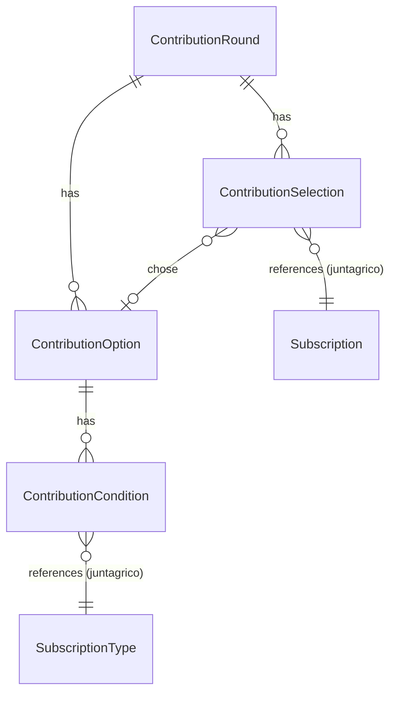

## Juntagrico-Contribution Data model

```mermaid
erDiagram
    ContributionRound ||--o{ ContributionOption : has
    ContributionRound ||--o{ ContributionSelection : has
    ContributionOption ||--o{ ContributionCondition : has
    ContributionCondition }o--|| SubscriptionType : "references (juntagrico)"
    ContributionSelection }o--|| Subscription : "references (juntagrico)"
    ContributionSelection }o--o| ContributionOption : "chose"
```
