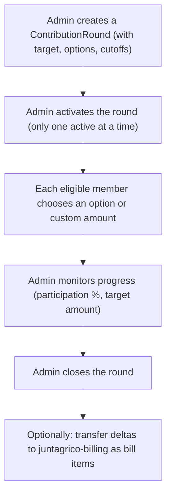

## What is juntagrico-contribution?

**juntagrico-contribution** is a Django extension (plugin) for [juntagrico](https://github.com/juntagrico/juntagrico), a management platform for community-supported agriculture cooperatives (Solidarische Landwirtschaft / Solawi). 

Its core purpose is to run **"Beitragsrunden"** (contribution rounds) — a process where cooperative members with active subscriptions choose how much they want to contribute financially, potentially above or below a nominal price.

## How it works

The flow looks like this:

### Key concepts

- **ContributionRound**: A time-bounded campaign with a financial target. The target can be a fixed amount or a multiplier of the total nominal subscription prices. It defines which subscriptions are eligible (via creation/cancellation cutoff dates, excluding trial subscriptions).

- **ContributionOption**: Predefined contribution tiers attached to a round. Each option has a **multiplier** relative to the subscription type price (e.g., 1.0x = nominal, 1.5x = 50% more, 0.8x = solidarity discount). Options can also have per-type overrides via **ContributionCondition**.

- **ContributionSelection**: A member's choice for a round — either a predefined option or a custom "other amount". Members can also flag "contact me if it's not enough."

## Two sides of the UI

**Member side:**
- See active contribution rounds and pick an option (radio buttons with price breakdowns) or enter a custom amount
- View past contributions

**Admin/management side:**
- Create rounds in Draft, then Activate, then Close
- Monitor participation rate, progress toward the target, and the option mix (via progress bars)
- Drill into details with a DataTable of all subscriptions and their selections
- Optionally transfer the **delta** (difference between chosen contribution and nominal subscription price) to **juntagrico-billing** as invoice line items

## Integration with juntagrico

It plugs into juntagrico via several touchpoints:
- References juntagrico's `Subscription`, `SubscriptionPart`, and `SubscriptionType` models
- Extends juntagrico's base templates and admin classes
- Injects menu items into juntagrico's user and admin navigation (via template overrides)
- Registers itself as a juntagrico addon in `AppConfig.ready()`
- Optionally integrates with **juntagrico-billing** for invoicing

## In plain terms

Imagine a food cooperative where members subscribe to weekly vegetable boxes. The box has a "nominal" cost, but the cooperative wants to run a solidarity-based pricing round: wealthier members can contribute more, others can contribute less. This plugin manages that entire process — setting up the round, letting members choose their tier, tracking whether the cooperative hits its revenue target, and optionally generating the corresponding bills.